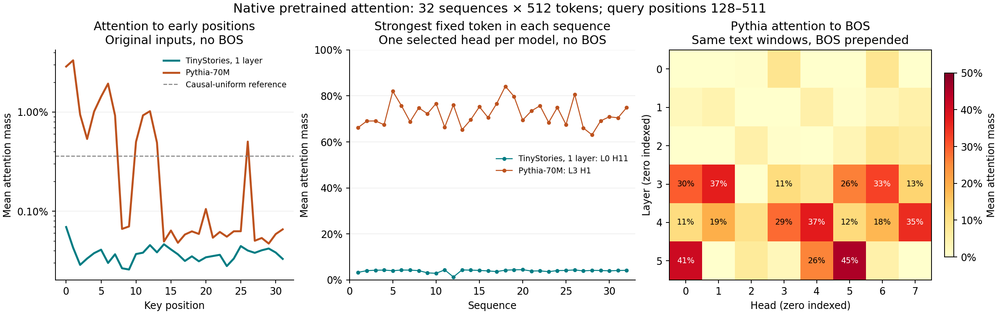

# Detecting sinks before replacing attention

The current TinyStories checkpoint is a poor test of sink preservation: we found
no strong persistent initial-token sink. Pythia-70M does show strong sink-like
concentration, often on early punctuation rather than position zero. With BOS
prepended, several Pythia heads consistently concentrate attention on BOS.



## Measurement

We used the first 96 TinyStories validation documents, tokenized separately with
the existing double-newline separator. The resulting stream was divided into
32 nonoverlapping 512-token windows. These windows have varied starting tokens;
they are not all story beginnings. Every window starts a fresh native forward.
No BOS is inserted in the primary run. The BOS control prepends the tokenizer's
existing `<|endoftext|>` token and drops the final token to retain length 512.

The diagnostic calls the original Hugging Face transformer with
`output_attentions=True`, eager attention, evaluation mode, FP32, and no KV cache.
It bypasses our attention replacements and language-model head. Measurements use
query positions 128–511, so all compared early positions have equal visibility.
Attention probabilities are already normalized over the causal context.

The reference probability for any early key is `mean_q(1/(q+1))`, or **0.3603%**.
We compare positions 0–3 with the equally sized control span 4–7 and the latest
four keys. We also search all key positions for each head's strongest fixed token
within each sequence, saving its position, identity, mass, and persistence.
This last search is exploratory; a high score alone does not prove that the
token is semantically irrelevant.

## Results

Masses below are averaged over all layers, heads, sequences, and eligible queries.

| Model and input | First token | First four tokens | Positions 4–7 | Latest four tokens |
| --- | ---: | ---: | ---: | ---: |
| TinyStories, no BOS | 0.069% | 0.174% | 0.145% | 39.672% |
| TinyStories, BOS | 0.265% | 0.377% | 0.139% | 39.661% |
| Pythia-70M, no BOS | 2.880% | 7.686% | 5.305% | 32.547% |
| Pythia-70M, BOS | 10.754% | 12.155% | 1.967% | 32.739% |

The per-head results reveal the important distinction:

- **TinyStories:** even the head with the strongest average fixed-token
  concentration allocates only **3.95%** to its selected token, averaged over
  later queries. Its selected token varies by sequence and is usually a story
  boundary. No head shows a strong persistent initial-token sink with or without BOS.
- **Pythia without BOS:** layer 3, head 1 allocates **72.22%** to one early
  punctuation/newline token per sequence, ranging from **63.07% to 84.18%** across
  the 32 windows. The selected tokens are `.` in 25 windows, `."` in five, and
  newline tokens in two. Their positions range from **0 to 26**. Only **14/32**
  lie within the first four positions, so retaining a fixed four-token prefix
  can miss the dominant sink. This fixed token exceeds the mass/enrichment
  thresholds below on **93.92%** of the measured queries.
- **Pythia with BOS:** layer 5, head 5 allocates **45.25%** to BOS on average;
  BOS is its most-attended fixed token in **all 32 windows**. Six heads pass the
  persistent-prefix screen. Layer and head indices are zero based.

The screening rule is explicit, not a universal definition: the first four keys
must receive at least 10% mass and five times their causal-uniform mass on at
least half of later queries, in at least 75% of windows. It finds 0/16 TinyStories
heads in both conditions, 0/48 Pythia heads without BOS, and 6/48 with BOS.
The zero count for Pythia without BOS reflects the restricted prefix and strict
cross-window requirement; it does **not** mean that the punctuation sinks are absent.

A longer check used 16 windows of 1024 tokens and query positions 512–1023,
without BOS. TinyStories again showed no strong persistent initial-token sink;
its first-four mass was 0.734%, versus 0.834% for positions 4–7. Pythia layer 3,
head 1 still put **63.71%** on its selected early punctuation/newline token.

These are observational diagnostics, not deletion experiments. They support
using **Pythia with explicit BOS** for the next initial-sink preservation test.
They do not establish that preserving this sink will repair an ELU linear
conversion. The [StreamingLLM paper](https://arxiv.org/html/2309.17453v4) motivates
the initial-token hypothesis; the numbers here are measurements of our checkpoints.

## Reproduce

Save the small input sample once (this step needs dataset access):

```bash
python - <<'PY'
import json
from itertools import islice
from pathlib import Path
from rttt.benchmarks import iter_corpus_texts
Path("results").mkdir(exist_ok=True)
texts = list(islice(iter_corpus_texts("tinystories", cache_dir=".cache/huggingface"), 96))
Path("results/sink-texts.json").write_text(json.dumps(texts, ensure_ascii=False))
PY

python -m rttt.sinks --texts results/sink-texts.json --local-files-only \
  --output results/sinks-tinystories.json
python -m rttt.sinks --model EleutherAI/pythia-70m \
  --texts results/sink-texts.json --local-files-only \
  --output results/sinks-pythia.json
```

Add `--prepend-bos` for the BOS control, or
`--sequences 16 --length 1024 --query-start 512` for the longer check, with a new
output filename. `--offset` changes the starting point in the source token stream.
The JSON includes all per-head position profiles, per-sequence peak tokens,
input hashes, settings, and model revisions. The uniform reference assumes
global causal attention; the models tested here have no local masks.

Checkpoint revisions:

- TinyStories-1Layer-21M: `0d983335d1447a805aa0f4c0c440e257a0a87f44`.
- Pythia-70M: `a39f36b100fe8a5377810d56c3f4789b9c53ac42`.

Source JSON SHA-256:
`68ad50af7d6fe06c74a38256da06b8cbfc33efce12cdfb48e989dab2a157d1ca`.
Runs used CPU, one thread, PyTorch 2.10.0, and Transformers 4.44.2.
Raw outputs are in `results/sinks-*.json`; model/data downloads and results are ignored by Git.
